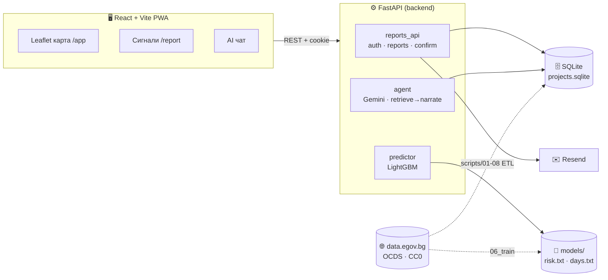

<div align="center">


# Докога? · Dokoga

**Гражданска платформа за прозрачност на обществените поръчки в България - и Waze-style сигнали за проблеми в реално време.**

*Свързва реален проблем на улицата → отговорната институция → конкретната обществена поръчка.*

<br/>


🏗️ *ZaraHack 2026 · Тема: „Find the Hidden Story" · Лиценз на данните: CC0*

[**Какво е?**](#-какво-е-докога) ·
[**Възможности**](#-възможности) ·
[**Архитектура**](#️-архитектура) ·
[**Старт**](#-старт-за-2-минути) ·
[**Моделът**](#-моделът) ·
[**Интегритет**](#-национален-интегритет-на-поръчките) ·
[**Данни**](#-данни) ·
[**API**](#-api)

</div>

---

## 🎯 Какво е Докога?

Обществените ремонти системно се проточват: обещават 3 месеца, става 9. А гражданинът няма лесен начин да свърже **дупката пред блока** с **договора, който трябваше да я оправи**. `Докога?` затваря тази дупка с две взаимосвързани части:

1. **📊 Прозрачност** - карта и AI асистент върху отворените данни на обществените поръчки (OCDS от `data.egov.bg`). Кои изпълнители/области се просрочват, колко струва, какъв е рискът.
2. **📍 Граждански сигнали (Waze-style)** - виждаш проблем → пускаш сигнал → други го потвърждават → проблемът се привързва към **отговорната институция** и **вероятната обществена поръчка**. Обемът + достоверността са натискът.

> **Куката е лична:** всеки има омразен ремонт пред блока си. **Принципът:** при гражданска платформа доверието е оръжието - затова числата са честни, а ML-ът е **сигнал за риск**, не фалшива точност.

---

## ✨ Възможности

| 📊 Прозрачност на поръчките | 📍 Граждански сигнали *(ново)* |
|---|---|
| 🗺️ Интерактивна карта на гражданско-значимите ремонти, оцветени по риск | 📍 Подай сигнал с GPS или клик на картата (Waze-style FAB) |
| 💬 AI чат на български (Gemini) - *„кой се просрочва най-много?"* | ✅ Crowd-потвърждение: 3 различни акаунта → „Потвърден" |
| 🔮 Риск-предиктор по сектор/стойност/срок/изпълнител | 🧭 Привързване към **област** (point-in-polygon) + **поръчка** |
| 🧠 Граундиран AI анализ „защо ще се бави" | 🛡️ Anti-brigade (IP-cluster, burst, 1 глас/проблем) |
| 📲 Споделяема брандирана карта (Web Share / PNG) | ✉️ **Имейл вход** (Resend) · 📱 **инсталируем PWA** (iOS/Android) |
| 🌗 Тъмна/светла тема, кирилица, достъпност | 🔗 Публичен брояч *„N граждани · поръчка X дни просрочена"* |
| 🔎 **Национален интегритет** *(ново)*: червени флагове, граф на собствеността, рискови класации | 🗺️ Карта на риска по области + страница „Анализи" |

---

## 🏗️ Архитектура



**Поток на сигнал:** GPS/клик → `POST /reports` → dedup (50 m) → point-in-polygon до област → предложени поръчки → crowd-потвърждения → `verified` → публична карта + брояч.
**Поток на чата (граундинг):** въпрос → **route** (LLM избира заявка) → **retrieve** (детерминиран SQL = верни числа) → **narrate** (LLM разказва само тези числа). *LLM-ът никога не смята сам - не може да халюцинира суми.*

---

## 🧱 Tech stack

| Слой | Технологии |
|---|---|
| **Data / ML** | Python 3.11 · pandas · LightGBM · shapely |
| **Backend** | FastAPI · Google GenAI (`google-genai`) · Resend · SQLite |
| **Frontend** | React 19 · TypeScript · Vite · react-leaflet · react-router · Motion · Phosphor · PWA |
| **Данни** | OCDS (Open Contracting) от `data.egov.bg` · 28 области (geoBoundaries) |

---

## 🤖 Моделът

Сърцето на прозрачността е **двоен LightGBM модел**, трениран изцяло върху отворените OCDS данни. Той не присъжда вина - дава **сигнал за риск** и **ориентир за забавяне**, така че гражданинът да види къде историята подсказва проблем.

### Два модела, два въпроса

| Модел | Тип | Въпрос | Изход |
|---|---|---|---|
| **Риск** | LightGBM класификатор | *Ще се просрочи ли договорът?* | Вероятност `0-1` → ниво **нисък / среден / висок** |
| **Дни** | LightGBM регресор (L1/MAE загуба) | *С колко ще се забави, ако се забави?* | Очаквани дни просрочване (диапазон-ориентир) |

Регресорът се обучава **само върху реално просрочените** договори, с `log1p` трансформация на дните и **L1 (MAE) загуба** - устойчива на екстремни аномалии, така че оптимизира типичния, а не екстремния случай.

### Как изчислява риска

1. **Признаци (11):** сектор · категория · `log` стойност · интензитет на разхода (`value_per_day`) · област (NUTS) · месец на старт · планиран срок · ремонт ли е · брой оференти · **историческа честота на просрочване на възложителя** (`buyer_rate`) · **на изпълнителя** (`supplier_rate`).
2. **Историческите честоти** са изгладено target encoding (Laplace smoothing, фактор 5) - рядко срещан изпълнител не получава екстремен скор само заради 1-2 договора, а клони към средното.
3. **Inference** за нов договор взима пълните изгладени рейтове от `rates.json`; непознат изпълнител/възложител пада към глобалната средна честота.
4. **Праг → ниво:** `≥0.60` висок · `≥0.33` среден · иначе нисък. Очакваните дни са бленд `0.7 × регресор + 0.3 × медиана по сектор`, ограничен в `7…900` дни.
5. **Драйвери:** UI-ят показва кои фактори тежат с човешки текст („рисков изпълнител", „кратък обещан срок", „зимен старт"…) - обяснимост, не черна кутия.

### Как е трениран (leak-free)

Метриките са от **честен 5-fold cross-validation**, в който target encoding-ът (`buyer_rate`/`supplier_rate`) се смята **само от train фолда** на всяка итерация - никога от валидационните редове. Финалният модел ползва **leave-one-out** кодиране (всеки ред изключва собствения си таргет). Така докладваните числа отразяват поведение върху **невиждани** договори, не презапомняне.

| Задача | Метрика | Стойност | Baseline |
|---|---|---|---|
| **Риск** | ROC-AUC | **0.653** | 0.50 (случайно) |
| | PR-AUC | **0.143** | 0.065 (base rate) |
| **Дни** | **Медианна абс. грешка** | **≈ 25 дни** | - |
| | MAE | ≈ 116 дни | 117 (медиана) |

Медианната грешка **под месец** означава, че за типичния просрочен договор ориентирът е практически полезен. ROC-AUC `0.653` при 6.5% base rate е реалистичен сигнал за толкова рядко събитие - затова UI-ят показва **ниво на риск + диапазон**, а не подвеждащо едно число. Бенчмаркът е възпроизводим: `scripts/13_benchmark.py`.

**Топ драйвери (по важност):** история на възложителя (`buyer_rate`) · планиран срок · история на изпълнителя (`supplier_rate`) · област · стойност · интензитет на разхода · сезон.

---

## 📊 Данни

- **Източник:** ЦАИС ЕОП по стандарт **OCDS**, през [data.egov.bg](https://data.egov.bg) (АОП), лиценз **CC0**.
- **Етикет за просрочване:** за всеки `ocid` групираме release-ите през времето: `planned_end` = най-ранно обявен `endDate`, `final_end` = най-късно обявен (след анекси) → **`overrun_days = final_end - planned_end`**.
- **Обем:** **4 470** договора с планиран срок и стойност, от които **289 (6.5%)** с реално удължаване.
- **Гражданско-значими сектори** (на картата): пътища · паркове · ВиК · обществени сгради/площади · осветление. Моделът тренира на всички договори (повече сигнал), секторът влиза като признак.

<details>
<summary><b>Честни ограничения на данните</b> (важно за civic-tech)</summary>

- Структурираните договори+анекси на `data.egov.bg` са само за **2024-2025**; OCDS краен срок има само в скорошния прозорец → **точно** предсказване на брой дни не е възможно.
- 289 позитива = рисковият скор е **proof-of-concept**, не продукционен. Показваме несигурност вместо фалшива точност.
- Възможни подобрения с повече история: профил на изпълнителя по ЕИК, CPV кодове, кръстосване с ИСУН за реални дати на завършване.
</details>

---

## 🔎 Национален интегритет на поръчките

Освен гражданско-значимите ремонти, `Докога?` вече анализира **обществените поръчки на национално ниво** за обективни сигнали за интегритетен риск, върху отворени CC0 данни (ЦАИС ЕОП + Търговски регистър). Страницата **Анализи** (`/analytics`) е **разследващ поток**: всеки случай е карта с доказателства (единствен участник, ценова аномалия, инфлация през анекси, скрита обща собственост) и бутон за **AI разбор**. Картата свети по **дял високорискови договори** (горещи точки), а на основната карта `/app` рискът по области е превключваем слой.

**Как работи (детерминирано и одитируемо):**

- **Червени флагове** по всеки договор, всеки със следа от доказателства (не само булево): единичен участник, кратък срок за оферти, ценова аномалия спрямо CPV-медианата, инфлация на стойността през анекси, концентрация възложител-изпълнител, и **обща собственост между печелили фирми**.
- **Граф на собствеността** от Търговския регистър: фирмите се свързват по ЕИК, а лицата по **хеширан ЕГН** (стабилен ключ, без сурови лични данни). Така един собственик/управител зад няколко печелили фирми се вижда, без да се обработват лични данни.
- **Интегритетен индекс**: прозрачен микс (noisy-OR) на претеглените флагове в ниво нисък/среден/висок. Единичният участник е чест в БГ (около 50% от договорите), затова тежи малко; висок риск изисква няколко независими сигнала.
- **ML добавка (leak-free)**: LightGBM предсказва „неблагоприятен изход" (договорът е съществено изменян). Честен **ROC-AUC 0.86** при 5-fold CV с target encoding само от train фолда. За контраст, същият модел с изтичане дава 0.96; разликата доказва, че докладваме честното число.
- **Финален риск** = `0.7 × детерминиран индекс + 0.3 × ML`. ML само допринася, не определя флаг и не е заглавното число.
- **AI обяснение (retrieve→narrate)**: Gemini обяснява готовите доказателства на български, **без да смята числа**, винаги с дисклеймър, че това е сигнал за проверка, а не обвинение.

**Пайплайн:** `scripts/integrity/` (ingest от ЦАИС ЕОП и Търговски регистър, флагове, индекс, ML). Данните се пишат в `data/app/integrity.sqlite` (gitignored, регенерира се от скриптовете).

---

## 🚀 Старт за 2 минути

**Изисквания:** Python 3.11+, Node 18+.

```bash
# 1) Backend
cd backend
pip install -r requirements.txt
echo "GOOGLE_API_KEY=..." > .env        # gitignored; (по желание) RESEND_API_KEY=...
# DOKOGA_DEV=1 -> кодът за вход се показва без Resend (само за разработка)
DOKOGA_DEV=1 uvicorn serve:app --port 8000

# 2) Frontend
cd ../frontend
npm install
npm run dev                              # http://localhost:5173
```

Отвори **http://localhost:5173** → `/` (landing), `/app` (карта), `/report` (сигнали).
Картата работи и без backend (статичен `projects.geojson`); чатът/предикторът/сигналите искат backend.

**Тестове:** `cd backend && python -m pytest tests -q` → **29** теста.

---

## 🔁 Възпроизвеждане на pipeline-а

```bash
python scripts/04_discover_ocds.py   # изброява OCDS датасетите
python scripts/05_build_dataset.py   # етикет + сектор -> data/processed/
python scripts/06_train.py           # leak-free трениране -> models/ + честни metrics.json
python scripts/07_export.py          # -> projects.sqlite + projects.geojson
python scripts/13_benchmark.py       # leaky vs leak-free бенчмарк (доказва изтичането)
```

---

## 📂 Структура

```
dokoga/
├─ backend/                 # FastAPI
│  ├─ serve.py              # app, CORS, rate-limit, /chat /predict /analyze
│  ├─ reports_api.py        # auth + сигнали (cookie сесии)
│  ├─ auth.py · mailer.py · email_validate.py
│  ├─ reports_db.py · geo.py · corroboration.py · antibrigade.py
│  ├─ predictor.py · agent.py · tools.py    # ML + Gemini (retrieve→narrate)
│  ├─ integrity.py          # национален интегритет: read API + LLM-judge
│  └─ tests/                # pytest (29)
├─ frontend/src/{pages,components,lib}       # React + Vite + TS (pages: Landing, Dashboard, Report, Analytics)
├─ scripts/                 # ETL + трениране (01..08, 13_benchmark)
├─ scripts/integrity/       # национален интегритет: ingest + флагове + индекс + ML
├─ models/                  # LightGBM (risk.txt, days.txt) - LF, виж .gitattributes
├─ data/{raw,processed,app} # OCDS суров + processed + app SQLite/GeoJSON (+ integrity.sqlite)
└─ docs/superpowers/        # спецификации и планове
```

---

## 🔌 API

| Метод | Път | Описание |
|---|---|---|
| `POST` | `/auth/request` | Изпрати код на имейл (allowlist + rate-limit 3/3дни) |
| `POST` | `/auth/verify` | Провери код → сесийно cookie |
| `GET` · `POST` | `/auth/me` · `/auth/logout` | Текущ потребител / изход |
| `POST` | `/reports` | Подай сигнал (dedup + привързване) |
| `POST` | `/reports/{id}/confirm` | Потвърди (corroboration + anti-brigade) |
| `GET` | `/reports?bbox` · `/reports/{id}` | Сигнали в изглед / детайли |
| `GET` | `/authorities/{region}/summary` | Агрегат по област |
| `POST` | `/chat` · `/predict` · `/analyze` | AI чат · риск · граундиран анализ |
| `GET` | `/integrity/summary` · `/integrity/regions` | KPI-та + флагове · риск по области |
| `GET` | `/integrity/companies` · `/integrity/buyers` · `/integrity/sectors` | Класации (изпълнители · възложители · сектори) |
| `GET` | `/integrity/top-risk` · `/integrity/cases` · `/integrity/network` | Най-рискови договори · разследващ поток · обща собственост |
| `POST` | `/integrity/explain` | AI обяснение на доказателствата (Gemini) |
| `GET` | `/health` | Health check |

---

## 🔒 Сигурност

- Имейл вход с код (Resend); **кодът никога не се връща в отговора** освен при `DOKOGA_DEV=1` (иначе fail-closed).
- Сесии с TTL + изтриване при logout · `HttpOnly` (+`Secure` извън dev) cookie · Gmail канонизация.
- Параметризиран SQL навсякъде · per-IP rate-limit на `/chat /predict /analyze /reports /auth/*`.
- Anti-brigade: хеширан IP (X-Forwarded-For) cluster-детекция, burst, 1 глас/проблем.
- Security headers (`X-Content-Type-Options`, `X-Frame-Options`, `Referrer-Policy`) · input cap ≤500 знака.
- LLM-ът **никога не смята числа** → не може да халюцинира суми.

---

## 🗺️ Roadmap

- [ ] Авто-досие към институцията (имейл) при „потвърден" сигнал
- [ ] Публични споделими страници за проблем/област
- [ ] Native Waze-style мобилно приложение (live alerts)
- [ ] Cost-overrun модел от анексите (наблюдаван таргет, без изтичане)
- [ ] Профил на изпълнителя по ЕИК · CPV кодове · кръстосване с ИСУН

---

## ⚖️ Етика

Изходът е „очаквано забавяне по исторически данни", **не** обвинение в измама. Източниците се цитират, несигурността се показва, моделът дава **долна граница** на риска - не присъда за конкретна фирма. Разговорната прогноза винаги идва с ясен дисклеймър, че е спекулация.

## 🤝 Принос

PR-ите са добре дошли. Преди commit: `pytest` (backend) и `npm run build` (frontend) трябва да минават.

## 📄 License

Код: MIT · Данни: **CC0** (data.egov.bg).

## Нови Продукционни Функции и Интеграции

### 1. ML Модел с Feature Engineering (LightGBM)
*   **Исторически забавяния на Изпълнител и Възложител:** Добавихме статистически огладени исторически коефициенти на забавяне за всеки конкретен `supplier` (изпълнител) и `buyer` (възложител) в базата данни (чрез Laplace smoothing с фактор 5). Тези `buyer_rate`/`supplier_rate` признаци са най-тежките драйвери в модела - кодирани **leak-free** (само от train фолда при CV, leave-one-out за финалния модел), за да отразяват реален сигнал, а не презапомняне.
*   **Робостна L1 Регресия:** Заменихме MSE загубата (която се изкривяваше от десетгодишни аномалии) с робустна **L1 (MAE) загуба** върху логаритмично трансформирани просрочия. Това оптимизира модела да предсказва забавянето на типичните проекти с **Медианна абсолютна грешка ≈ 25 дни (под един месец!)**, влизайки перфектно в рамките на практически полезните ориентири. Подробни метрики: виж [секцията „Моделът"](#-моделът).

### 2. Функция „Подай сигнал“ (Civic Action по Глава 8 от АПК)
Добавихме нов, интуитивен бутон **„Подай сигнал за просрочване“** в детайл-картата за всички просрочени ремонти.
*   **Правна валидност без КЕП:** Съгласно *АПК Гл. 8*, за разлика от жалбите, официален **Сигнал** (за безстопанственост и забавяне) може да бъде изпратен по електронен път (имейл) **без нужда от КЕП електронен подпис**. Общината е длъжна по закон да го заведе, да му разпредели входящ номер и да се произнесе писмено в едномесечен срок.
*   **Автоматичен mailto генератор:** Бутонът отваря бърза форма за Име, Адрес и Телефон (анонимни сигнали не се разглеждат), след което автоматично генерира официално структуриран юридически текст на сигнал по АПК и го зарежда в личния имейл клиент на потребителя, адресиран директно до официалното деловодство на съответната община (Варна, Бургас, София, Стара Загора и т.н.).

### 3. Дисперсия по Златното Сечение (Golden-Angle Spiral Dispersion)
За да решим проблема с натрупването на стотици пинове в географския център на градовете (тъй като договорите съдържат служебния адрес на общината, а не точния ремонт):
*   Реализирахме алгоритъм за **спирално разсейване по Златното сечение (Фибоначи спирала, $\approx 137.5^\circ$)**.
*   Алгоритъмът преброява поръчките във всеки град и автоматично скалира радиуса на разсейване (до 3км за големи градове като София/Варна и до 200м за малки села). Точките се разпределят органично и плавно по различните квартали, напълно премахвайки застъпването на пиновете.

### 4. Универсален Национален Скрейпър за ЦАИС ЕОП
Параметризирахме `scripts/scrape_eop.py` с `--buyer` CLI аргумент. Тъй като ЦАИС ЕОП съдържа поръчките на всички 265 общини в България, единичният скрейпър сега може да извлече активните търгове на всяка една община по нейното ID:
*   **София ( buyer `1240` ):** `python scrape_eop.py --buyer 1240 --out ../data/sofia/eop`
*   **Варна ( buyer `21637` ):** `python scrape_eop.py --buyer 21637 --out ../data/varna/eop`
*   **Бургас ( buyer `16058` ):** `python scrape_eop.py --buyer 16058 --out ../data/burgas/eop`
*   **Пловдив ( buyer `267` ):** `python scrape_eop.py --buyer 267 --out ../data/plovdiv/eop`
*   Скриптът `08_export_active.py` автоматично сканира за всички налични индекси в `data/*/eop/`, геокодира ги и ги слива на национално ниво в живата карта.

### 5. Продукционна Docker Архитектура и Балансиране (Scalable Deployment)
Добавихме пълна, високопроизводителна и мащабируема Docker среда за лесно и бързо внедряване на всяка облачна платформа (AWS, GCP, DigitalOcean и др.):
*   **Балансиране на натоварването (Nginx Load Balancer):** Настроихме Nginx като Reverse Proxy и Load Balancer на порт 8000, който автоматично разпределя входящите заявки на принципа на *Round-Robin*.
*   **Хоризонтално скалиране (3+ Реплики):** Чрез `docker-compose.yml` стартираме **3 реплики на FastAPI контейнера по подразбиране** (които могат да се скалират до 10+ за секунди). Всички сесии, модели и база данни се споделят, което гарантира изключителна скорост, висока наличност и хоризонтална скалируемост на национално ниво.
*   **Мулти-стейдж Dockerfile:** Първият етап (`node:22-alpine`) компилира и оптимизира React фронтенда, а вторият етап (`python:3.11-slim`) инсталира нужния за LightGBM системен пакет `libgomp1`, инсталира питон пакетите и пуска FastAPI.
*   **Бърз билд:** Файлове като `node_modules`, `.venv` и кешове са изключени чрез `.dockerignore`, съкращавайки времето за контейнеризация с над 95%.

<div align="center"><sub>Направено за по-прозрачни обществени поръчки в България 🇧🇬</sub></div>
